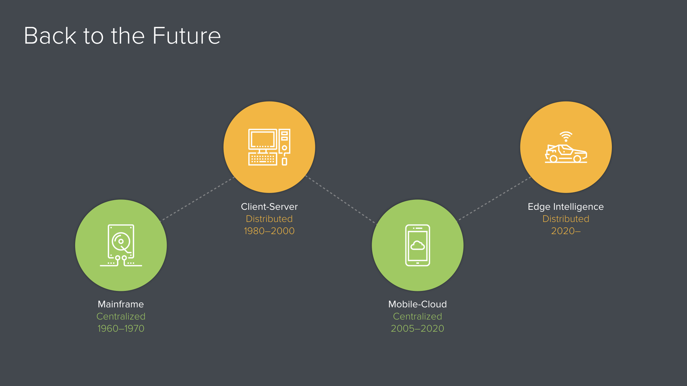
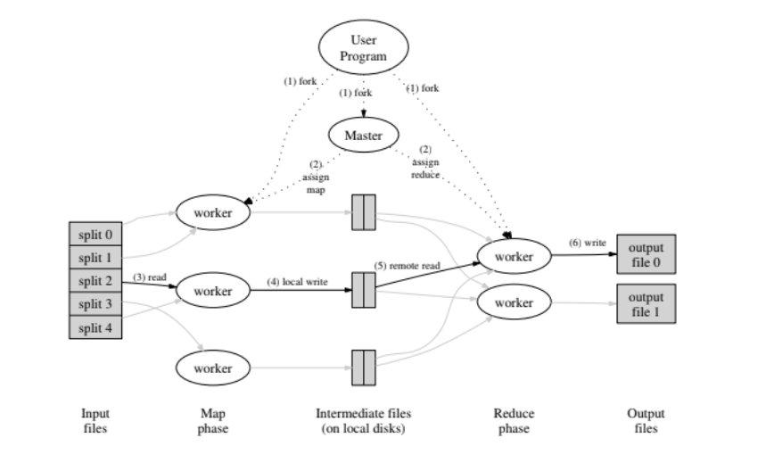
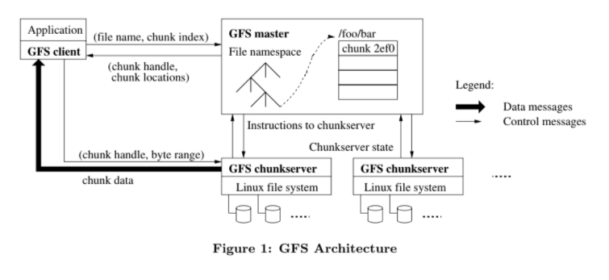

# Introduction

In the early 2000s Warehouse Scale Computing (WSC) was thought to be a niche market for few giant tech companies that could afford the scale and cost of such infrastructure. In recent years we have see high demand in WSC moving towards cloud computing due to

1.  Economies of scale

2.  cloud compute as a service/ The ubiquity of cloud providers

[The Datacenter as a Computer (3rd Ed.)](https://cs.nyu.edu/~apanda/classes/sp21/papers/dc-computer-v3.pdf) Ch 1 provides an overview of the primary components of a WSC namely -  server, storage, networking and the challenges that accompany its massive scale. Ch 2. Explores common software methods used to ensure hjigh performance in large distributed systems. 

Source: a16z

With the influx of large amounts of data on the web, due to widespread availability of internet, Google developed a scalable distributed file system for large distributed data intensive applications - namely, [GFS.](https://cs.nyu.edu/~apanda/classes/sp21/papers/gfs.pdf) [MapReduce](https://cs.nyu.edu/~apanda/classes/sp21/papers/mapreduce.pdf) was introduced to parallelize simple computational tasks for processing and generating large
data sets. while abstracting out the messy underlying details of parallelization, fault-tolerance, data distribution
and load balancing in a library.

# Motivation

The papers aim to provide an overview of

1.  The trends in large scale computing

2.  Physical constraints/ challenges

3.  Opportunities/ gaps in the current system

and underlying distributed storage systems, prog models.

The aim of these paper readings is To provide the reader with tools to evaluate and provide critical feedback on system design in large scale.

The key question in this reading is **WHY** was the system designed in this manner. This enables the reader to evaluate other such systems.

GFS - Looks at creating a distributed storage system for Google's internal storage

*We have designed and implemented the Google File Sys-*

*tem (GFS) to meet the rapidly growing demands of Google's*

*data processing needs.*

Map Reduce - Explores a programming paradigm to **abstract** out messy details (parallelization, fault-tolerance, data distribution and load balancing in a library) in parallel programming  → Making it easier for programmers to parallelize programs →
*The issues of how to parallelize the computation, distribute the data, and handle failures conspire to obscure the original simple computation with large amounts of complex code to deal with these issues. As a reaction to this complexity, we designed a new abstraction that allows us to express the simple computations we were trying to perform but hides the messy details of parallelization, fault-tolerance, data distribution and load balancing in a library.*
1)  parallel programming becomes important 2003 dennard scaling failed.  → (Ref. No free lunch for developer) - 2004 map reduce for large data processing \-\--BS?
2)  Amount of data available grows.

# Approaches
**Wsc** -

Back of the envelope calculations\
Profilers

Performance

Reed salomon code over replication

**https://research.google.com/archive/mapreduce-osdi04-slides**
### Map reduce
**Map reduce** is a programming paradigm introduced by Google for processing and generating large data sets. The input and output are both sets of key value pairs. The programmer defines 2 functions :
-   **Map function** : map (in_key, in_value)  → list(out_key, intermediate_value)
    -   Processes input key value pair and produces set of intermediate pairs
-   **Reduce function** : reduce (out_key, list(intermediate_value))  → list(out_value)
    -   Combines all intermediate values for a particular key to produce a set of merged output values
The paper discusses Google's implementation of MapReduce that enables automatic parallelization and distribution of large scale computations on a large cluster of commodity machines and is highly performant .

-   **Fault tolerance** : Handled via re-execution
    -   Worker failure
        -   Detection : Periodic heartbeats sent by master node
        -   Recovery
            -   Map tasks : In progress and completed are both re-executed because map workers have intermediate results saved to local disks of the failed machine.
            -   Reduce tasks : Only in progress tasks are re-executed. Completed reduce tasks do not need to be re-executed since their output is stored in a global file system.
    -   Master failure - Unhandled. If master fails, the map reduce job is aborted. The client can retry the operation.
    -   *Semantics in presence of failures*
        -   *Atomic commits to guarantee same o/p as sequential machine*
        -   *the atomic rename operation provided by the underlying file system to guarantee that the final file system state contains just the data produced by one execution of the reduce task.*

-   **Tail latency** : Handled by redundant execution
    -   Causes :
        -   Other jobs consuming resources on machine
        -   Bad disks with soft errors transfer data very slowly
        -   Disabled processor caches
    -   Near the end of the phase - backup copies of the straggler tasks are spawned. Whichever one finishes first \"wins\"
    -   Effect: reduction in unpredictable tail latency

-   **Locality optimisation :** Bringing code to the data
    -   Master scheduling policy:
        -   Queries GFS for locations of replicas of input file blocks
        -   Map tasks typically split into 64MB (to take advantage of the underlaying storage system - GFS block size)
        -   Map tasks scheduled so GFS input block replica are on same machine or same rack
        -   Without this, rack switches limit read rate
        -   Effect: Thousands of machines read input at local disk speed. Saves on network bandwidth

-   **Skipping bad records**
    -   Best solution - debug and fix bad records.
    -   Some faults (such as those dependent on the client libraries) cannot be fixed within a reasonable time frame. Next best alternative -
        -   On error - send UDP packet to master to indicate record that failed.
        -   Send the same record to another worker to ensure that it is not a one-off machine error.
        -   If 2 failures occur  → Master instructs the next worker to skip the record.
    -   Effect : Handles bugs in 3rd party libraries with bad inputs.

-   **Other Refinements**
    -   Sorting guarantees within each reduce partition
    -   Compression of intermediate data
    -   Combiner: useful for saving network bandwidth
    -   Local execution for debugging/testing
    -   User-defined counters 

-   **Applications of map reduce**
    - The reading outlines simple use cases as well as web related application (web indexing) for map reduce. Map reduce paradigm is also applicable to SGD in the deep learning context as outlined by [Zhao and Canny](https://people.eecs.berkeley.edu/~jfc/papers/13/butterflymixing.pdf).
    - 
     
### Google file system

a scalable distributed file system for large distributed data-intensive applications.

-   Data flow is decoupled from control flow
    -   Client fetches metadata from the master
    -   Client queries chunkserver directly for data operations
    -   This implementation allows us to tune performance by scheduling data flow based on the network topology.  → Using pipelining as opposed to other topologies like tree.  

-   Master node:
    -   Responsibilities:
        -   Stores all file system metadata in memory
        -   Controls all system wide activities - managing chunk leases, reclaiming storage space, load-balancing
    -   Single master - [GFS: Evolution on Fast-forward](https://queue.acm.org/detail.cfm?id=1594206)
        - Simplify the overall design problem. 
        - A central place to control replication and garbage collection and many other activities was simpler than handling it all on a distributed basis.
    -   Operation log:
        -   persistent record of metadata
        -   logical timeline that defines the serialized order of concurrent operations
    -   Recovery - Shadow master - read-only access to the file system, even when primary master is down. They read a replica of the operation log and apply the same sequence of changes. Master recovers from checkpoints on operation log.
-   Chunkserver
    -   Store the chunks (64 MB)on local disks as Linux files
    -   Metadata per chunk is \< 64 bytes (stored in master)
        -   Current replica locations
        -   Reference count (useful for copy-on-write)
        -   Version number (for detecting stale replicas)
    -   Fully replicated (for high availability) - default replication factor:3
-   Consistency model
-   Handling writes
    -   Record append allows multiple clients to append data to the same file concurrently while guaranteeing the atomicity of each individual client's append.
    -   Concurrency - It is useful for implementing multi-way merge results and producer- consumer queues that many clients can simultaneously append to without additional locking. Atomicity with minimal synchronization overhead
-   Data integrity

[[The Google File System]{.ul}][4]

# Trade Offs
### Map reduce

-   Not for time sensitive applicatiƒons
-   Intelligently define reduce / intermediate steps. Otherwise it may take a really long time
-   Rigid  → Abstraction. But makes it easy to onboard developers - practical world opex
-   
Map reduce disadvantages :\
[[https://cacm.acm.org/magazines/2010/1/55744-mapreduce-a-flexible-data-processing-tool/fulltext]{.ul}][5]
*Startup latency*. MapReduce implementations should strive to reduce startup latency by using techniques like worker processes that are reused across different invocations;
*Data shuffling*. Careful attention must be paid to the implementation of the data-shuffling phase to avoid generating O(M\*R) seeks in a MapReduce with M map tasks and R reduce tasks;
*Textual formats*. MapReduce users should avoid using inefficient textual formats;
*Natural indices*. MapReduce users should take advantage of natural indices (such as timestamps in log file names) whenever possible; and
*Unmerged output*. Most MapReduce output should be left unmerged, since there is no benefit to merging if the next consumer is another MapReduce program.

**GFS**

GFS architectural problems GFS master

● One machine not large enough for large FS
● Single bottleneck for metadata operations
● Fault tolerant, not HA Predictable performance
● No guarantees of latency : High sustained bandwidth is more important than low latency.
- Typical workloads/ file access patterns:
    -   Reads
        -   Large streaming reads
        -   Small random reads
    -   Writes
        -   Large sequential write
        -   Rarely modified
        -   Concurrent writes
    -   Unsuited for real time systems
-   64 MB chunk - Larger than most file systems
    -   Disadvantages:
        -   Wasted space due to internal fragmentation
        -   Small files consist of a few chunks, which then get lots of traffic from concurrent clients
    -   Advantages:
        -   Reduces clients' need to interact with master (reads/writes on the same chunk only require one request)
        -   Since client is likely to perform many operations on a given chunk, keeping a persistent TCP connection to the chunkserver reduces network overhead
        -   Reduces the size of the metadata stored in master → metadata can be entirely kept in memory
# Open Questions and Future Work

Shift towards edge computing \[4\]- https://a16z.com/2019/11/15/the-end-of-cloud-computing-2/

![][6]![][7]

Cloud computing to edge computing. Credit: a16z

Wikipedia says:

>"Edge computing is a distributed computing paradigm which brings computation and data storage closer to the location where it is needed, to improve response times and save bandwidth. Modern edge computing significantly extends this approach through virtualization technology that make it easier to deploy and run a wider range of applications on the edge servers.\"

Today's world is a centralized world, and the central cloud is where all processing gets done. The proliferation of the internet of things has resulted in generation of vast amounts of data that needs to be processed in real time. The existing infrastructure will be unable to handle this volume and rates.Compute hungry machine learning on these sensors has further catalysed the edge adoption. Peer to peer networks can be used to reduce load on the core network and share data locally. This move will shift processing to the edge.

#### GFS

[Evolution of GFS within Google](https://pierrezemb.fr/posts/colossus-google/):
GFS was later replaced by Colossus, D and supported by BigTable.
-   From [Storage Architecture and Challenges(2010)](https://cloud.google.com/files/storage_architecture_and_challenges.pdf):
    -   Move from full replication in GFS to [Reed-Salomon]() in Colossus → replication is handled by the client and the server, instead of the pipelining → saves network bandwidth on the server side.
    -   the metadata layer is automatically sharded.
-   From [GFS: Evolution on Fast-forward(2009)](https://queue.acm.org/detail.cfm?id=1594206)
    -   Chunk size was reduced to 1MB as the limitations of the master disappeared. This allows Colossus to support latency sensitive applications,
-   From [Cluster-Level Storage @ Google(2017)](http://www.pdsw.org/pdsw-discs17/slides/PDSW-DISCS-Google-Keynote.pdf):
    -   GFS master replaced by Colossus
    -   GFS chunkserver replaced by D
    -   Colossus rebalances old, cold data
    -   distributes newly written data evenly across disks
    -   Metadata is stored into BigTable. each Bigtable row corresponds to a single file. Adoption of BigTable provides several advantages
        -   It removed the single point of failure in GFS master
        -   Automatic sharding of regions
        -   Lexical ordering

With the Google Home Ecosystem being widely adopted, New offerings like Anthos (hybrid cloud management) and Edge TPU look promising for edge computing. Google's file storage will now have to support latency sensitive applications.

#### Map-Reduce
[[https://medium.com/\@oscarstiffelman/a-brief-history-of-mapreduce-97aec97df8ff]{.ul}][13]
It was part of a paradigm of computing based on transformations of immutable data into sorted records. The key insight in this paradigm: sorting \> hashing.
maintain the intermediate data in byte-reversed order. This lets me interpret the data as streams of little-endian integers which lets me do 8x as many comparisons per cycle while preserving the same lexical ordering. → key idea? Intermediate representation is important for performance
[[https://www.cs.cmu.edu/\~pavlo/slides/mapreduce-pavlo09.pdf]{.ul}][14]
[[https://cacm.acm.org/magazines/2010/1/55744-mapreduce-a-flexible-data-processing-tool/fulltext]{.ul}][5]
MapReduce in Practice •Abstract input and output interfaces --lots of MR operations don't just read/write simple files • B-tree files • memory-mapped key-value stores • complex inverted index file formats • BigTable tables • SQL databases, etc. • \... •Low-level MR interfaces are in terms of byte arrays --Hardly ever use textual formats, though: slow, hard to parse --Most input & output is in encoded Protocol Buffer format\
\
\
***Borg?***

\-\-\-\-\-\-\-\--

Citations

\[1\]

\[2\] McKusick, Kirk, and Sean Quinlan. \"GFS: evolution on fast-forward.\" *Communications of the ACM* 53.3 (2010): 42-49

\[3\] [[https://cs.stanford.edu/\~matei/courses/2015/6.S897/slides/gfs.pdf]{.ul}][4]

\[4\] https://a16z.com/2019/11/15/the-end-of-cloud-computing-2/

  -- --
     
     
  -- --

ß  [1]: media/image1.png {width="6.5in" height="3.6527777777777777in"}
  [2]: media/image5.png {width="6.5in" height="3.9583333333333335in"}
  [3]: media/image4.png {width="6.5in" height="2.986111111111111in"}
  [4]: https://cs.stanford.edu/~matei/courses/2015/6.S897/slides/gfs.pdf
  [5]: https://cacm.acm.org/magazines/2010/1/55744-mapreduce-a-flexible-data-processing-tool/fulltext
  [6]: media/image3.png {width="2.8958333333333335in" height="2.929134951881015in"}
  [7]: media/image2.png {width="3.03125in" height="2.9166666666666665in"}
  [8]: https://pierrezemb.fr/posts/colossus-google/
  [9]: https://cloud.google.com/files/storage_architecture_and_challenges.pdf
  [10]: https://en.wikipedia.org/wiki/Reed%E2%80%93Solomon_error_correction
  [11]: https://queue.acm.org/detail.cfm?id=1594206
  [12]: http://www.pdsw.org/pdsw-discs17/slides/PDSW-DISCS-Google-Keynote.pdf
  [13]: https://medium.com/@oscarstiffelman/a-brief-history-of-mapreduce-97aec97df8ff
  [14]: https://www.cs.cmu.edu/~pavlo/slides/mapreduce-pavlo09.pdf
